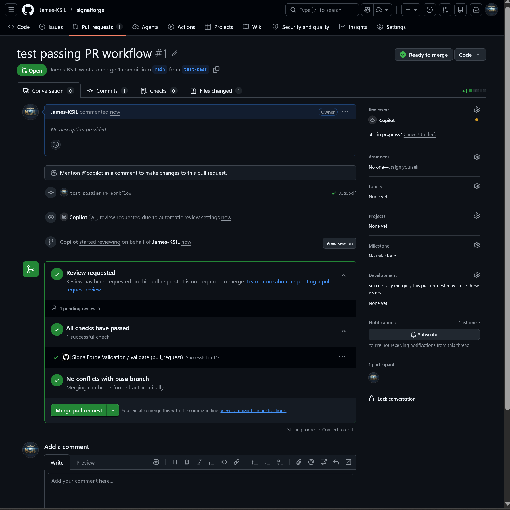
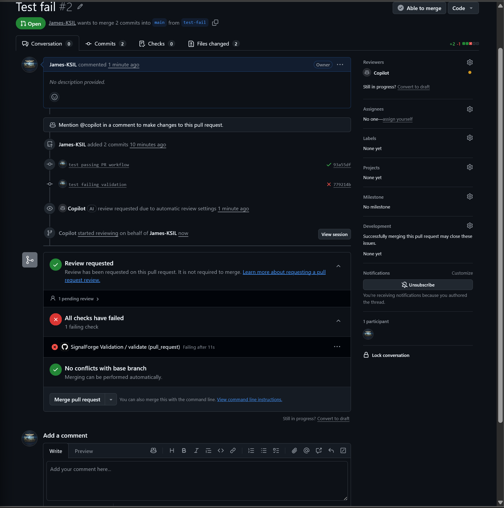

# SignalForge

Deterministic DevEx CLI for validating engineering intent before merge.

## Problem

AI-assisted workflows produce untrusted outputs. Teams can move faster, but they also risk merging changes that drift from declared intent, violate constraints, or exceed approved scope.

## Solution

SignalForge enforces explicit contracts using deterministic validation. A contract is declared in `signalforge.yaml`, evaluated by a CLI gate, and returned as an unambiguous result: `SAFE` or `NOT SAFE`.

## Core Concepts

- `intent`: what the change is supposed to accomplish.
- `constraints`: explicit, testable rules that must hold.
- `scope`: the only directories/files allowed for the change context.
- `deterministic gate`: a repeatable validation pass with no probabilistic scoring.
- `SAFE / NOT SAFE`: binary output with violation reasons when unsafe.

## Minimal Public Structure

```text
SignalForge/
	README.md
	signalforge.yaml
	scripts/
		sf-validate.ts
```

## Example

### `signalforge.yaml`

```yaml
intent: "Validate implementation against declared engineering intent"
constraints:
	- "all validation must be deterministic"
	- "declared scope must exist"
	- "scope must contain TypeScript files"
scope: "apps/vscode-extension/src"
```

### CLI Command

```bash
npx tsx scripts/sf-validate.ts
```

### Output Example (`SAFE`)

```text
SAFE
```

### Output Example (`NOT SAFE`)

```text
NOT SAFE
- Declared scope does not exist: apps/missing-dir
- Declared scope contains no TypeScript files: apps/missing-dir
```

## Architecture (High Level)

```text
developer input -> contract -> validation -> result
```

SignalForge intentionally exposes this flow without publishing proprietary implementation logic.

## Design Principles

- deterministic over heuristic
- contracts over inference
- advisory-first (no auto-merge control)
- explainability over opacity

## Status

30-day validation pilot (CLI + GitHub Actions integration in progress)
Validation status: PASS test branch

## Validation Evidence

SignalForge enforces deterministic validation at PR time.

### Passing Contract


### Failing Contract


## Out of Scope

- no AI inference
- no scoring systems
- no dashboards
- no SaaS
